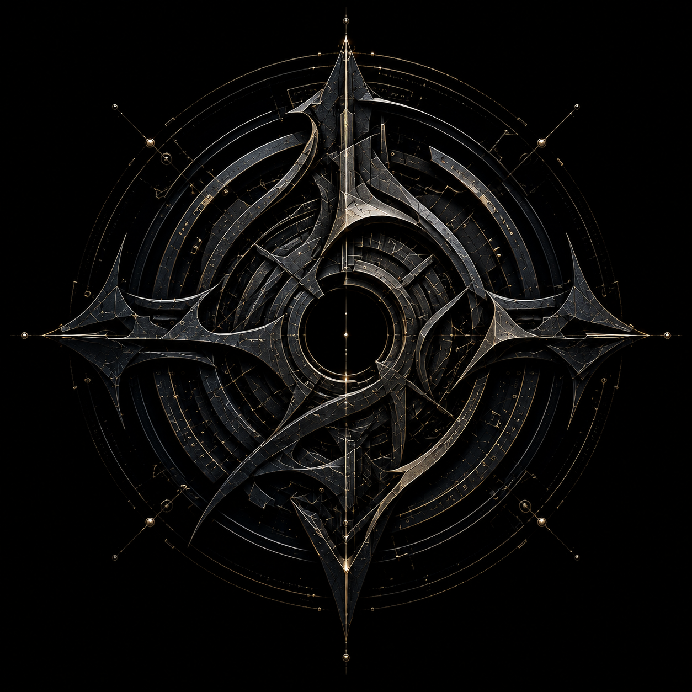

  

  

<h1 align="center">VAELIXIAN</h1>

<strong>Autonomous Intake Infrastructure & Enterprise Data Routing Layers</strong>

---

### 🌐 System Matrix Overview
> **VAELIXIAN** deploys proprietary, zero-human-touch middleware frameworks designed to isolate and optimize data ingestion pipelines. Built specifically to eliminate administrative friction and front-office latency within heavy commercial contractor ecosystems and structural operations networks, the system operates as a permanent, non-stop automation layer.

---

### ⚙️ Institutional System Parameters

| Core Component | Configuration Specification |
| :--- | :--- |
| **System Class** | Unstructured Data Parsing Matrix & Middleware Ingestion Node |
| **Network Architecture** | Isolated Core Routing Loops & Automated Capture Arrays |
| **Primary Target Node** | Heavy Industrial B2B Pipelines & Enterprise CRM Networks |
| **Synchronization Status** | Fully Operational // Continuous Environment Monitoring Active |

---

### 🛠️ Architectural Infrastructure Layers
* **Autonomous Payload Capture:** Continuous monitoring arrays engineered to intercept inbound project files, bid invites, and unstructured communication streams instantly.
* **Data Validation Engine:** High-performance architectural layers that clean, parse, and structure raw multi-format payloads with zero human intervention.
* **Direct Database Injection:** Low-latency routing loops that synchronize verified structured datasets directly into native core enterprise databases.

---

### 🔒 Operational Compliance & Security
To preserve absolute data integrity, all active routing nodes, pipeline infrastructure environments, and custom architecture audits run within dedicated, highly secure network sectors.

* **Corporate Communications Desk:** vaelixian.ops@gmail.com
* **Security Verification Node:** Active / Private Vault
